# WebSim-Agent：面向推荐系统的问题性使用风险仿真

*基于结构化 Persona、LLM 决策、时间步社会调度和 WebSim 交互的多用户行为模拟系统。*

> [!IMPORTANT]
> 本项目输出的是**仿真研究指标**，不是临床诊断结果。高点击、高活跃或深夜使用不能单独证明沉迷；高风险判断需要停止失败、重要目标冲突以及跨会话重复证据。

WebSim-Agent 用人工用户研究推荐系统中的浏览、点击、离开、回访和问题性使用风险。每个 Agent 都拥有独立画像、心理状态、行为记忆、日程目标和 24 小时活动基线。系统既可以在本地推荐数据上运行百级至万级模拟，也可以通过 Playwright 在 WebSim 网页中执行真实点击。

设计参考：

- **TinyTroupe**：结构化 Persona、群体 sampling space、个体差异、episodic/semantic memory 和 proposition 检查；
- **OASIS**：Agent–Environment–Action–Observation–Memory 与时间推进；
- **CAMEL-AI**：Agent、策略、工具、环境和管理器的模块化分离。

项目没有把 TinyTroupe、OASIS 或 CAMEL 作为强制运行依赖，也没有复制它们的实现。

## 目录

- [核心能力](#核心能力)
- [系统架构](#系统架构)
- [快速开始](#快速开始)
- [Examples](#examples)
- [Persona 生成](#persona-生成)
- [日内多会话模拟](#日内多会话模拟)
- [LLM 模式](#llm-模式)
- [WebSim 真实网页模式](#websim-真实网页模式)
- [风险判断](#风险判断)
- [实验输出](#实验输出)
- [项目结构](#项目结构)
- [测试](#测试)
- [研究限制](#研究限制)

## 核心能力

- 按学生、上班族、夜班人群、退休人群定向生成 Persona；
- 按群体比例生成覆盖 sampling space 的可复现人口样本；
- 每个 Agent 独立维护兴趣、人格、自控力、生活规律和媒体习惯；
- 基于个人 24 小时活动基线生成一天内多次 session；
- 使用规则策略或 OpenAI-compatible LLM 决定 `click` / `next_page`；
- 通过时间步 Scheduler 调度大量 Agent，不为每个 Agent 常驻线程或浏览器；
- 支持本地 simulator 和真实 WebSim/Playwright 环境；
- 保存 episodic session、纵向 semantic summary 和逐步证据；
- 区分高投入、观察状态、单会话风险与跨会话问题性使用高风险；
- API 失败、429、超时或非法 JSON 时自动回退规则策略。

## 系统架构

```text
Persona
  ↓
Scheduler选择本轮Agent
  ↓
Environment提供推荐候选
  ↓
规则快速过滤
  ↓
规则决策或LLM决策
  ↓
JSON与动作校验
  ↓
执行click / next_page
  ↓
更新心理状态和Memory
  ↓
计算跨会话风险
```

Agent 生命周期：

```text
OFFLINE → ACTIVE → IDLE / SLEEPING → OFFLINE → ... → FINISHED
```

- `OFFLINE`：当前 session 已结束，等待当天下一次计划上线；
- `ACTIVE`：本时间步正在执行动作；
- `IDLE`：当前 session 仍愿意继续；
- `SLEEPING`：当前访问中暂时恢复疲劳和无聊；
- `FINISHED`：实验周期结束，不再上线。

## 快速开始

### 环境要求

- Python 3.10 或更高版本；
- 本地 simulator/rule 模式只需要 Python 标准库；
- WebSim 模式需要项目原有 Flask、数据和 Playwright 环境；
- LLM 模式需要 OpenAI-compatible API。

进入 Agent 项目目录：

```powershell
cd C:\Users\lchk\Desktop\surf\D8EAX\project_versions\llm_agent
```

最小离线测试：

```powershell
python src\mini_agent.py --track 5
```

100-Agent 一天多会话模拟：

```powershell
powershell -ExecutionPolicy Bypass -File examples\run_100_agents_daily_rule.ps1
```

脚本会先生成 100 个结构化 Persona，再完成一天的本地多会话模拟，全程不需要 API Key 或浏览器。

如果直接输入 `examples\xxx.ps1` 时看到“禁止运行脚本”，这是 Windows PowerShell 的执行策略，不是 Agent 报错。请像上面一样仅为本次命令加上 `-ExecutionPolicy Bypass`，无需修改系统的永久安全设置。

## Examples

以下示例采用与 TinyTroupe README 相近的呈现方式：先展示实际运行结果，再给出用途、运行脚本和核心实现。全部命令集中在 [`examples/`](./examples/)；更完整的代码索引见 [`examples/SOURCE_MAP.md`](./examples/SOURCE_MAP.md)。

### Example 1 — 生成结构化用户群体

<p align="center">
  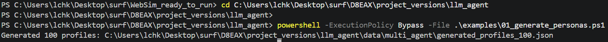
</p>
<p align="center"><em>使用固定 seed 成功生成 100 个结构化 Persona。</em></p>

按照可编辑的群体比例生成具有职业、作息、人格、兴趣、目标、自控力与 24 小时活动基线的个体画像。相同配置与随机种子可以复现同一批用户。

<p align="center">
  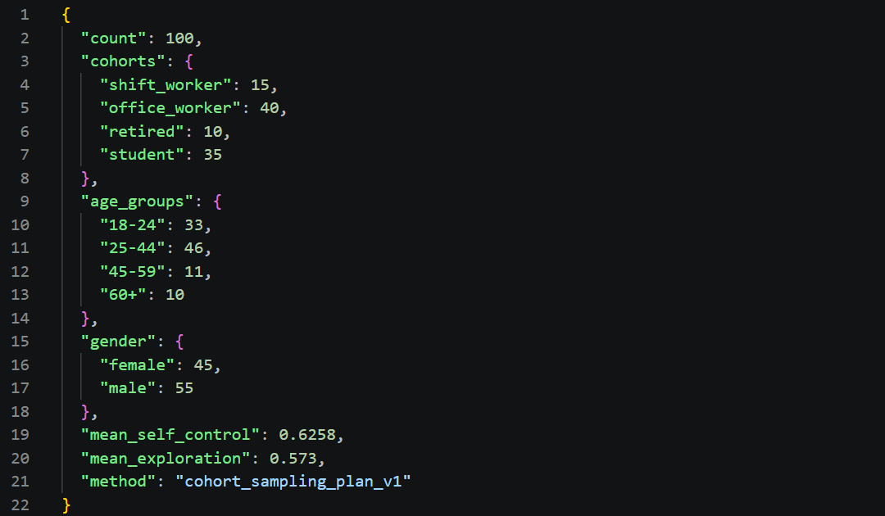
</p>
<p align="center"><em>群体、年龄和性别分布，以及群体平均自控力与探索倾向。</em></p>

<details>
<summary><strong>查看完整 Persona 示例：agent_00001</strong></summary>
<br>
<p align="center">
  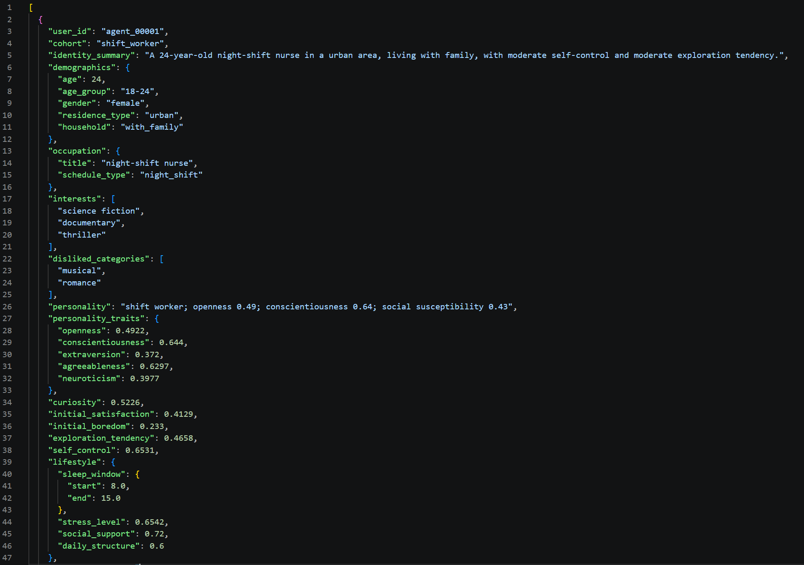
</p>
<p align="center">
  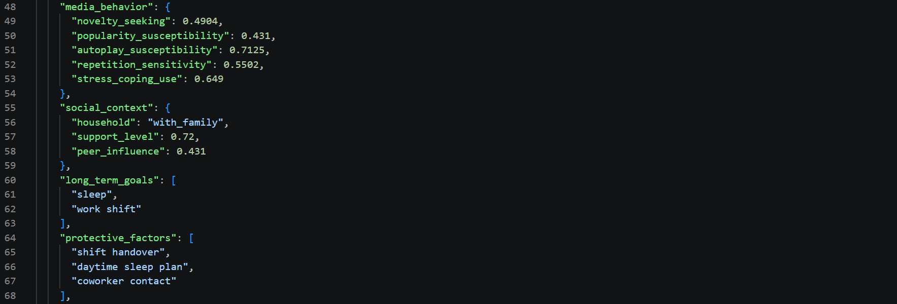
</p>
<p align="center">
  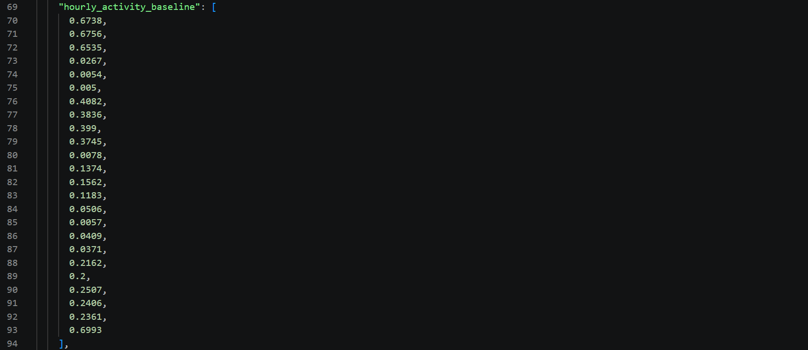
</p>
<p align="center">
  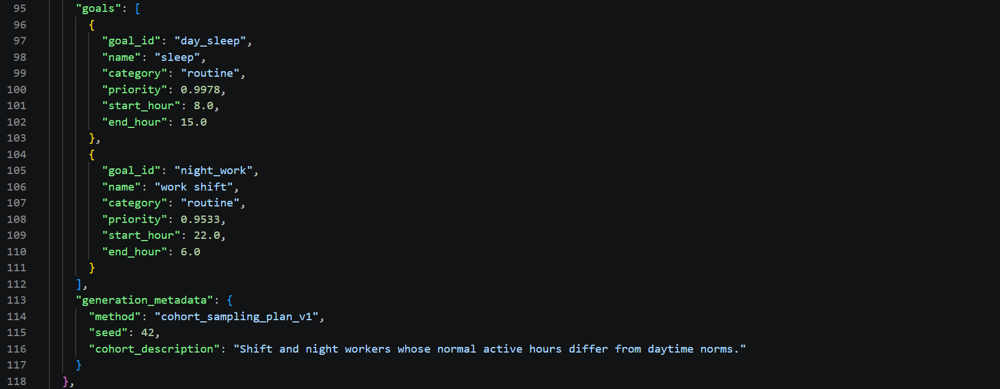
</p>
</details>

```powershell
powershell -ExecutionPolicy Bypass -File examples\01_generate_personas.ps1
```

- 运行脚本：[`examples/01_generate_personas.ps1`](./examples/01_generate_personas.ps1)
- 命令入口：[`generate_personas.py`](./generate_personas.py)
- 核心实现：[`src/persona_factory.py`](./src/persona_factory.py)

### Example 2 — 100 Agent 日内多会话模拟

<p align="center">
  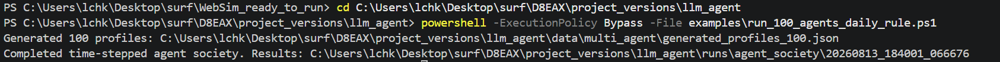
</p>
<p align="center"><em>本地 simulator 完成 100 Agent 的一天多会话模拟。</em></p>

100 个 Agent 根据各自的活动基线在一天内多次进入 session。Scheduler 每个时间步只激活一部分 Agent，并在本地推荐数据上完成点击、翻页、休眠、返回和退出。

<p align="center">
  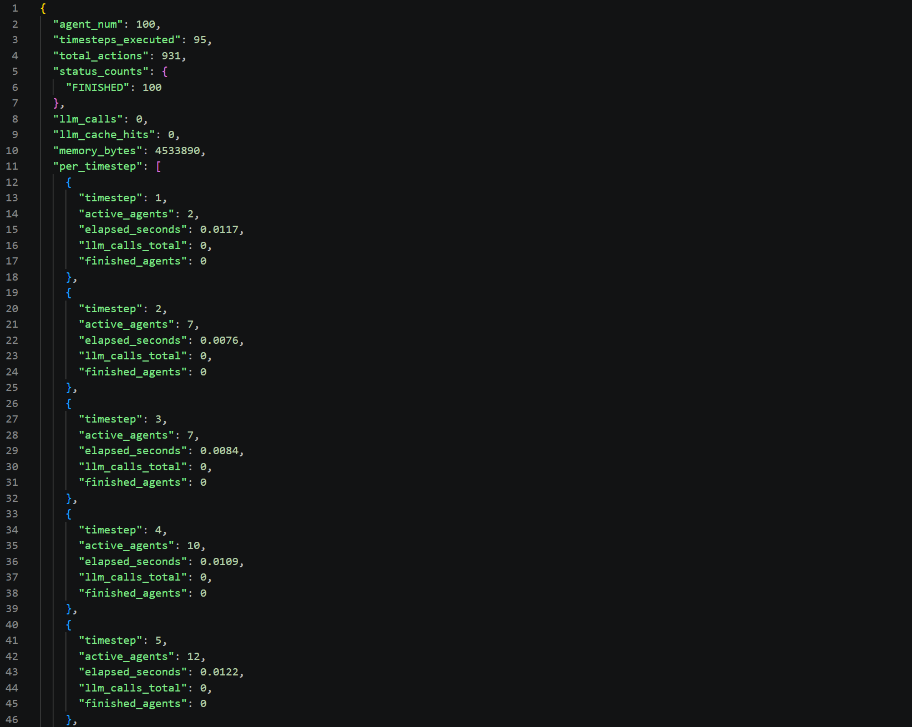
</p>
<p align="center"><em>本次规则模拟执行 95 个时间步和 931 个动作，100 个 Agent 全部完成；规则模式不调用 LLM。</em></p>

```powershell
powershell -ExecutionPolicy Bypass -File examples\run_100_agents_daily_rule.ps1
```

- 运行脚本：[`examples/run_100_agents_daily_rule.ps1`](./examples/run_100_agents_daily_rule.ps1)
- 命令入口：[`run_agent_society.py`](./run_agent_society.py)
- 调度实现：[`src/society_scheduler.py`](./src/society_scheduler.py)
- 心理与规则决策：[`src/mini_agent.py`](./src/mini_agent.py)

### Example 3 — LLM-driven User Agent 与风险检测

<p align="center">
  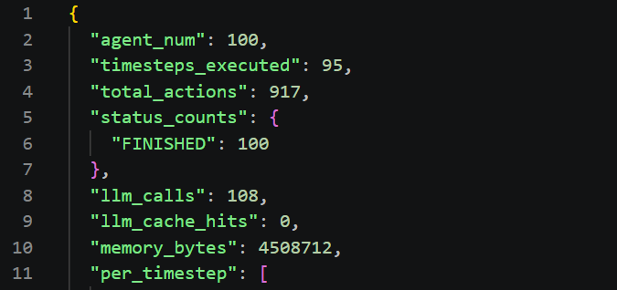
</p>
<p align="center"><em>100 Agent 共执行 917 个动作，其中 108 次进入 LLM 深度决策。</em></p>

每个 Agent 将自己的 Persona、当前候选、心理状态、最近记忆和社交信息发送给 OpenAI-compatible 模型。模型返回受约束的 JSON 决策；无效输出或 API 错误会自动回退到规则策略。运行结束后，PsyBer-PUR v2 根据活动异常、停止失败、目标冲突和跨会话持续性汇总风险证据。

<p align="center">
  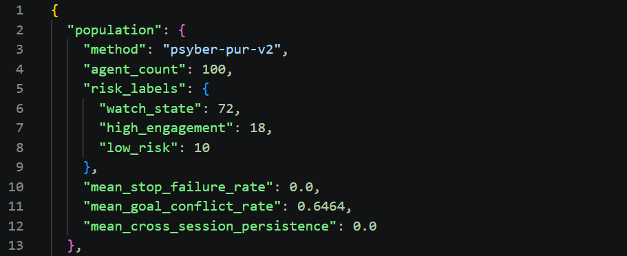
</p>
<p align="center"><em>总体风险分布：72 个 watch state、18 个 high engagement、10 个 low risk。</em></p>

<details>
<summary><strong>查看 agent_00001 的三次 session 风险证据</strong></summary>
<br>
<p align="center">
  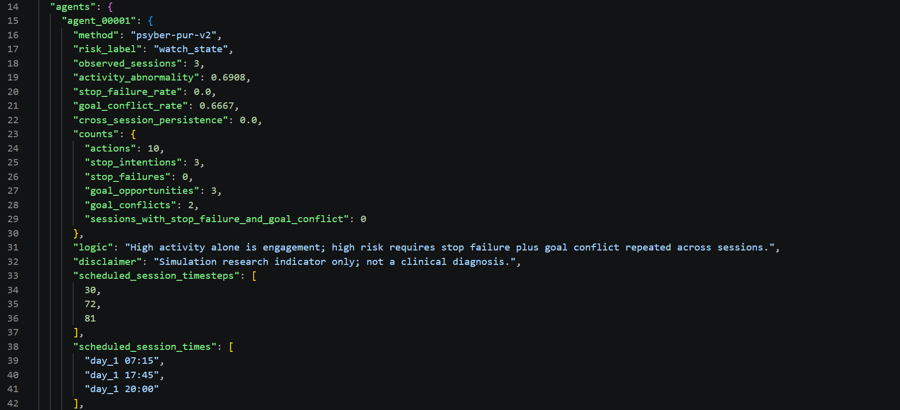
</p>
<p align="center">
  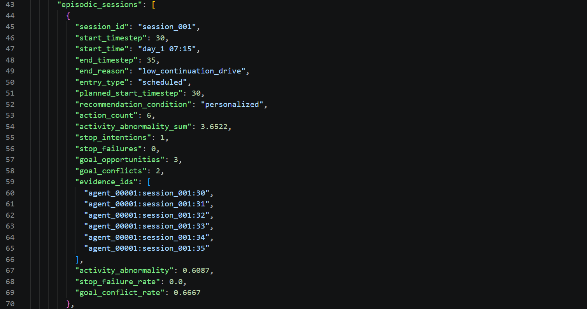
</p>
<p align="center">
  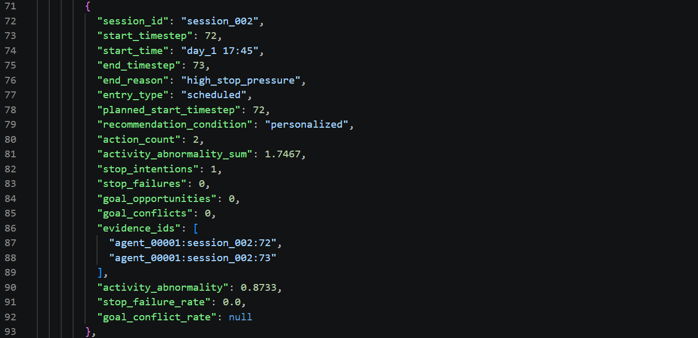
</p>
<p align="center">
  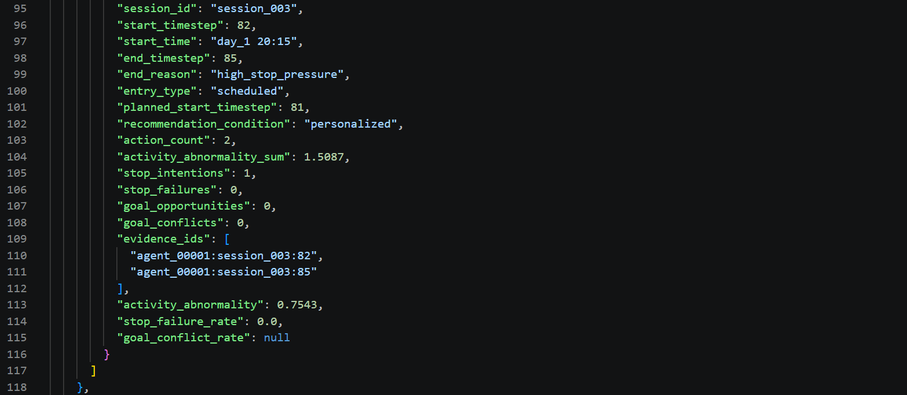
</p>
</details>

```powershell
$env:MODEL_API_KEY="your-key"
$env:MODEL_BASE_URL="https://your-provider.example/v1"
$env:MODEL_NAME="your-model"
powershell -ExecutionPolicy Bypass -File examples\run_100_agents_daily_llm.ps1
```

- 运行脚本：[`examples/run_100_agents_daily_llm.ps1`](./examples/run_100_agents_daily_llm.ps1)
- LLM 策略与校验：[`src/llm_user_agent.py`](./src/llm_user_agent.py)
- Prompt 模板：[`src/agent_prompts.py`](./src/agent_prompts.py)
- 并发调度：[`src/society_scheduler.py`](./src/society_scheduler.py)
- 风险证据与标签：[`src/problematic_use.py`](./src/problematic_use.py)

## Persona 生成

Persona Factory 先按比例制定群体 sampling plan，再在群体模板内生成有差异的个体。相同配置和 seed 会生成相同画像。

结构化画像包括：

- cohort、年龄组、家庭与居住环境；
- 职业和作息类型；
- Big Five 人格；
- 兴趣、厌恶和长期目标；
- curiosity、self-control、exploration tendency；
- 24 小时活动基线；
- 睡眠、工作、学习等高优先级目标；
- 压力、社会支持和日常结构；
- 新奇、热点、自动播放、重复内容和压力性媒体使用倾向；
- 保护因素和生成元数据。

默认群体比例：

```text
student       30%
office_worker 40%
shift_worker  15%
retired       15%
```

运行：

```powershell
python generate_personas.py `
  --count 100 `
  --seed 42 `
  --population-spec data\multi_agent\population_spec.example.json `
  --output data\multi_agent\generated_profiles_100.json
```

人口规范可在 [`population_spec.example.json`](./data/multi_agent/population_spec.example.json) 中直接修改，不需要改 Python。

详细说明见 [`docs/persona_generation.md`](./docs/persona_generation.md)。

## 日内多会话模拟

日内模式根据个人活动基线和目标生成每天 2–4 次计划 session：

```text
24小时基线 + 目标优先级 + self-control + seeded sampling
                         ↓
               当天计划上线时间
```

高基线小时更容易被抽中；重要目标会根据自控力降低上线权重；`seed` 保证可复现。夜班用户可以在凌晨拥有高基线，因此不会仅因凌晨使用而被当作异常。

```powershell
python run_agent_society.py `
  --profiles-path data\multi_agent\generated_profiles_100.json `
  --agent-num 100 `
  --active-agents-per-step 20 `
  --max-concurrency 10 `
  --policy rule `
  --environment simulator `
  --daily-multi-session `
  --simulation-days 1 `
  --start-hour 0 `
  --timestep-minutes 15 `
  --sessions-per-day-min 2 `
  --sessions-per-day-max 4 `
  --seed 42
```

## LLM 模式

LLM 模式使用 OpenAI-compatible Chat Completions 接口。API 配置只从环境变量或命令行读取，不写入源码或运行输出。

```powershell
$env:MODEL_API_KEY="your-key"
$env:MODEL_BASE_URL="https://your-provider.example/v1"
$env:MODEL_NAME="your-model"

powershell -ExecutionPolicy Bypass -File examples\run_100_agents_daily_llm.ps1
```

LLM 输入包括：

- 完整 Persona；
- 当前模拟时间和重要目标；
- 当前候选内容；
- 心理状态；
- 最近行为和跨会话摘要；
- 社交信号；
- 允许执行的动作。

模型只提出 JSON 决策，不能直接控制环境：

```text
LLM → JSON解析 → action/item校验 → Action Executor → Environment
```

API 未配置、超时、429、502、连接中断或非法输出都会记录 `api_error`，然后自动使用规则策略继续。

## WebSim 真实网页模式

WebSim 必须先在 `http://127.0.0.1:19002/` 正常运行。随后执行：

```powershell
powershell -ExecutionPolicy Bypass -File examples\run_websim_headless.ps1
```

流程：

```text
Playwright observe_page()
→ 提取网页候选
→ Agent决策
→ ActionExecutor校验
→ click / next_page / refresh
→ 保存浏览器状态和行为Memory
```

默认采用无界面后台浏览器。WebSim 模式适合较小规模真实交互，千级以上实验建议使用 simulator。

详细说明见 [`docs/websim_llm_agent.md`](./docs/websim_llm_agent.md)。

## 风险判断

PsyBer-PUR v2 记录五类证据：

1. **活动异常**：观察到的使用时间偏离个人 24 小时基线；
2. **停止失败**：Agent 已经产生停止意图，但实际仍继续；
3. **目标冲突**：继续使用挤占睡眠、工作或学习等高优先级目标；
4. **跨会话持续性**：停止失败与目标冲突是否在多个 session 重复；
5. **推荐强化效应**：相同 Persona/seed 下，处理组停止失败率减去对照组停止失败率。

风险标签：

| 标签 | 含义 |
|---|---|
| `high_engagement` | 使用异常或投入较高，但没有控制受损证据 |
| `watch_state` | 出现一个核心警告，完整模式尚未形成 |
| `elevated_risk_single_session` | 单个 session 同时出现停止失败和目标冲突 |
| `problematic_use_high_risk` | 上述组合在多个 session 重复，且比率达到阈值 |

人口群体、年龄或性别不会直接产生风险标签。详细公式见 [`docs/addiction_metrics.md`](./docs/addiction_metrics.md)，实现见 [`src/problematic_use.py`](./src/problematic_use.py)。

## 实验输出

每次 society 运行在 `runs/` 下创建独立目录：

```text
agent_states.sqlite3       Agent持久化状态
memory_events.jsonl        每个时间步的观察、决策、动作与证据
checkpoint.json            可恢复的时间步和状态计数
global_summary.json        全局运行统计
problematic_use_report.json 纵向风险结果和session明细
addiction_report.json      兼容的PsyBer-ARI v1报告
llm_cache.json             本次运行的LLM决策缓存
config.json                脱敏配置，不包含API Key
summary.txt                可读摘要
```

配对实验另外生成：

```text
recommendation_effect.json
```

## 项目结构

```text
project_versions/llm_agent/
├── run_agent_society.py       时间步社会模拟入口
├── generate_personas.py       定向画像生成入口
├── compare_risk_runs.py       推荐条件配对分析入口
├── run_multi_agent.py         原有小规模WebSim多Agent入口
├── src/
│   ├── persona_factory.py     群体sampling plan与Persona生成
│   ├── society_scheduler.py   时间、并发和生命周期调度
│   ├── mini_agent.py          Profile、规则策略和心理更新
│   ├── llm_user_agent.py      OpenAI-compatible LLM策略
│   ├── agent_prompts.py       Prompt模板
│   ├── websim_agent.py        Playwright工具和动作执行
│   ├── problematic_use.py     纵向风险证据和标签
│   └── addiction_metrics.py   兼容的PsyBer-ARI v1
├── data/multi_agent/          人口规范和生成画像
├── examples/                  可运行的PowerShell示例
├── docs/                      方法和运行文档
├── tests/                     自动化测试
└── runs/                      实验输出
```

## 测试

```powershell
powershell -ExecutionPolicy Bypass -File examples\run_tests.ps1
```

或直接运行：

```powershell
python -m unittest discover -s tests -v
```

当前已验证：

- Persona 比例、唯一性、结构合法性和 seed 复现；
- 日内多 session 开启、关闭与全天封存；
- 规则模式确定性；
- LLM click/next_page、非法 JSON、错误 item ID；
- 超时、429、502 与 fallback；
- 心理状态边界；
- WebSim 动作分发；
- 风险标签和配对推荐效应。

## 研究限制

> [!CAUTION]
> 内置群体比例、人格参数和心理更新系数属于合成研究假设，不是临床常模或人口调查结论。

- 正式论文实验应以有出处的调查数据替换人口比例和参数；
- 需要记录调查变量到仿真参数的映射；
- 应跨 seed、阈值和推荐条件进行敏感性分析；
- 应检查不同群体的误判率和公平性；
- 配对模拟只能说明模型设定下的效应，不能直接证明现实因果关系；
- 所有风险输出只适用于仿真研究，不能诊断真实个人。

## 参考说明

本项目在架构思想上参考 TinyTroupe、OASIS 与 CAMEL-AI，但当前实现是 WebSim-Agent 项目内的独立模块。参考项目的 README、论文或代码不构成本项目输出真实性与临床有效性的保证。
